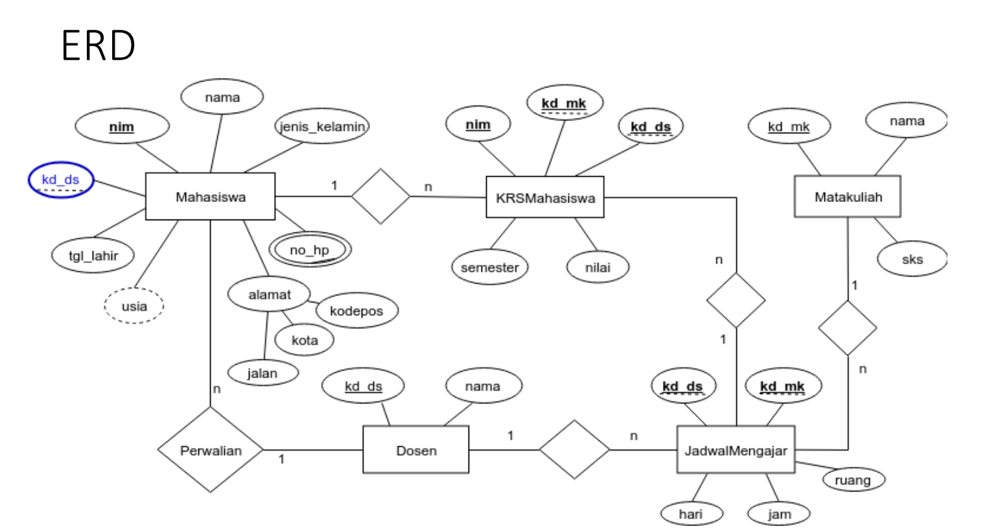

# latihan2-SQL

## **DDL (Data Definition Language) & DML (Data Manipulation Language)**
      
Transform **ER-D** ke dalam **Mapping Table**            
* **Data Model Mapping**        
    - **Mahasiswa** (**nim**, nama, jenis_kelamin, tgl_lahir, jalan, kota, kodepos, no_hp, kd_ds)     
    - **Dosen** (**kd_ds**, nama)     
    - **Matakuliah** (**kd_mk**, nama, sks)       
    - **JadwalMengajar** (**kd_ds**, **kd_mk**, hari, jam, ruang)     
    - **KRSMahasiswa** (**nim**, **kd_mk**, **kd_ds**, 
semester, nilai)       

### **A. Script DDL & DML**
1. **DDL *Script***     
    Data definition Language (DDL) adalah bahasa pemrogaraman yang digunakan untuk mengola objek database, seperti tabel, indeks, dan constraint. DDL digunakan untuk membuat, mengubah dan menghapus struktur database, termasuk tabel, kolom, kunci utama, indeks dan tampilan.       
    Berikut adalah perintah-perintah DDL yang digunakan untuk membuat sebuah DBMS berdasarkan skema diatas.
    - Membuat sebuah database: 
        ```sql
        CREATE DATABASE nama_database;
        ```
    - Menggunakan database:
        ```sql
        USE nama_database;
        ```
    - Membuat sebuah tabel:
        ```sql
        CREATE TABLE nama_tabel (field1,...,fieldn) VALUE
        (value1 tipe_data(ukuran),...,
        (valuen tipe_data(ukuran))
        );
        ```
    - Menambah PRIMARY KEY:
        ```sql
        ALTER TABLE nama_tabel ADD PRIMARY KEY (nama_field)
        ```
    - Menambah CONSTRAINT FOREIGN KEY:
        ```sql
        ALTER TABLE nama_tabel ADD CONSTRAINT nama_constraint
        FOREIGN KEY (nama_field) REFERENCES nama_tabel_referensi(nama_field_referensi)
        ```
    - Menambah AUTO INCREMENT:
        ```sql
        ALTER TABLE nama_tabel MODIFY nama_field tipe_data(ukuran) AUTO_INCREMENT;
        ```
2. **DML *Script***
    Data Manipulation Language (DML) adalah bahasa yang digunakan untuk mengakses, memanipulasi, dan mengubah data dalam database.
    Berikut adalah perintah-perintah DML yang digunakan untuk membuat sebuah DMS berdasarkan skema diatas.
    - Menambah data:
        ```sql
        INSERT INTO <table_name> (filed1,...,fieldn) VALUE (val1,...,valn);
        ```
    - Mengubah data:
        ```sql
        UPDATE <table_name> SET [field1=val1,..,fieldn=valn] WHERE <kondisi>
        ```
    - Menghapus data: 
        ```sql
        DELETE FROM <table_name> WHERE <kondisi>
        ```
    - Menampilkan data:
        ```sql
        SELECT * FROM <table_name>
        ```
    - Menampilkan data sesuai kondisi:
        ```sql
        SELECT * FROM <table_name> WHERE <kondisi>
        ```
        Selisih tahun
        ```sql
        SELECT * FROM <table_name> WHERE TIMESTAMPDIFF (YEAR, tgl_lahir, CURDATE()) < usia
        ```
        Sesuai urutan
        ```sql
        SELECT * FROM <table_name>  WHERE ORDER BY <acuan>
        ```
        sesuai field/kolom yang diinginkan
        ```sql
        SELECT <field1,...,fieldn> FROM <nama_tabel>;
        ```

####  **B. Evaluasi dan Pertanyaan**

- **Tulis semua perintah-perintah SQL percobaan di atas beserta outputnya!**    
[Script_DDL_DML](#a-script-ddl--dml)        
- **Apa bedanya penggunaan BETWEEN dan penggunaan operator >= dan <=?**     
    Penggunaan BETWEEN pada sintaks pertama menentukan dua nilai batas, dalam hal ini '1990-10-10' AND '1992-10-11', AND memeriksa apakah nilai pada kkolom tgl_lahir berada di antara kedua nilai tersebut, termasuk kedua nilai batas.
    Sedangkan pada sintaks kedua, penggunaan operator >= dan <= memeriksa apakah nilai pada kolom tgl_lahir lebih besar dari atau sama dengan '1990-10-10' dan kurang dari atau sama dengan '1992-10-11'.
- **Berikan kesimpulan anda!**      
    Kesimpulannya, kedua sintaks tersebut dapat digunakan untuk mengambil data rentang nilai tertentu dari kolom tanggal lahir pada sebuah tabel. Namun, dalam penggunaannya tergantung pada preferensi pengguna dan persyaratan atau standar yang diterapkan pada pengolahan data di suatu database.

SELESAI.
